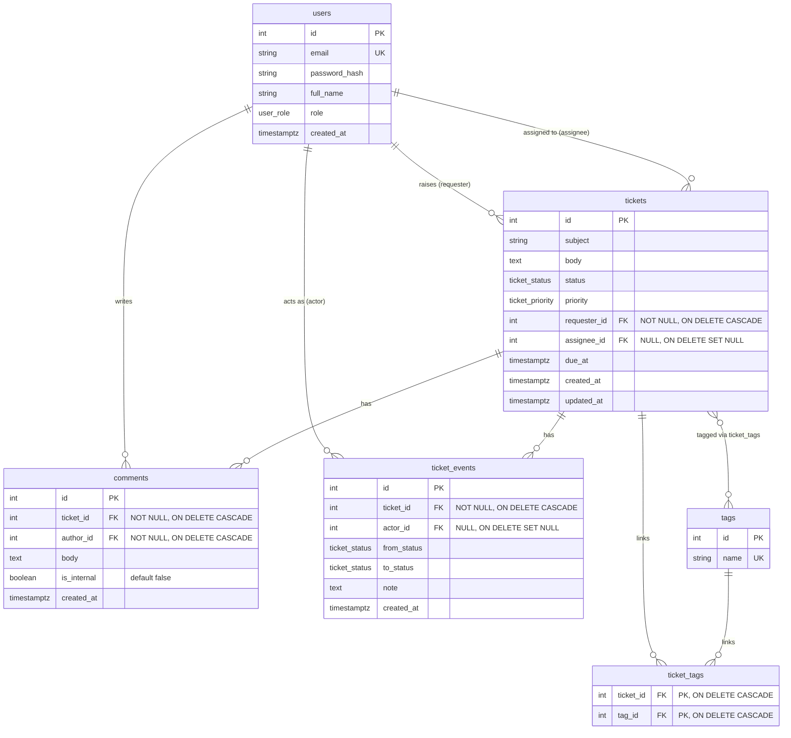

# Support Desk — Entity Relationship Diagram

**Enums**
- `user_role`: `customer` | `agent` | `admin`
- `ticket_status`: `open` | `in_progress` | `resolved` | `closed`
- `ticket_priority`: `low` | `normal` | `high` | `urgent`